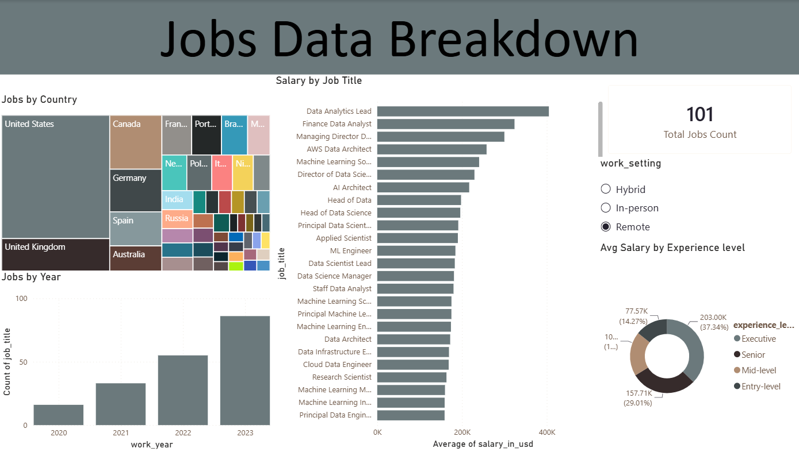

# Tech Job Market & Salary Analysis (Power BI Dashboard)

##  Business Overview
This Power BI dashboard analyzes global data and tech job market dynamics, salary distributions across job roles, experience levels, and work-setting preferences (Remote vs In-person vs Hybrid).

---

##  Dashboard Preview

---

## Key Technical Skills & Power BI Features Applied
- **Data Modeling & Transformation:** Cleansed and structured multi-year global job market dataset within Power Query.
- **Interactive Slicers:** Implemented dynamic filtering across work settings (`Remote`, `Hybrid`, `In-person`) and hiring locations.
- **Visual Analytics:** Applied Treemaps for geographic density, Bar Charts for salary hierarchy, and Donut Charts for experience breakdown.
- **Time-Series Growth Analysis:** Visualized YoY job volume trends spanning multiple hiring cycles.

---

## Key Findings
1. **Compensation Leaders:** Executive and specialized AI/Data Architecture roles command the highest average compensation packages globally.
2. **Work-Setting Demand:** Remote positions show strong representation, offering flexible hiring across global markets.
3. **Experience Segmentation:** Senior and Mid-level roles comprise the majority of total job postings.

---

## 📁 Repository Structure
- `Github_Dashboard.pbix`: Dynamic Power BI Report file containing data model and visuals.
- `dashboard_preview.png`: High-resolution dashboard screenshot.
- `README.md`: Project documentation and executive summary.

